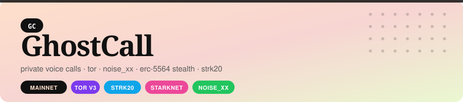
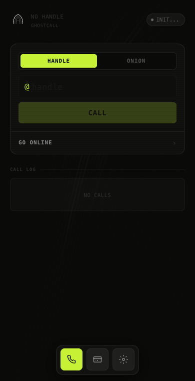
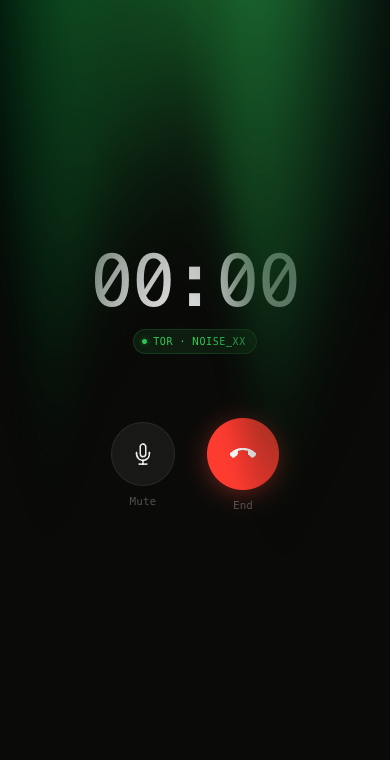
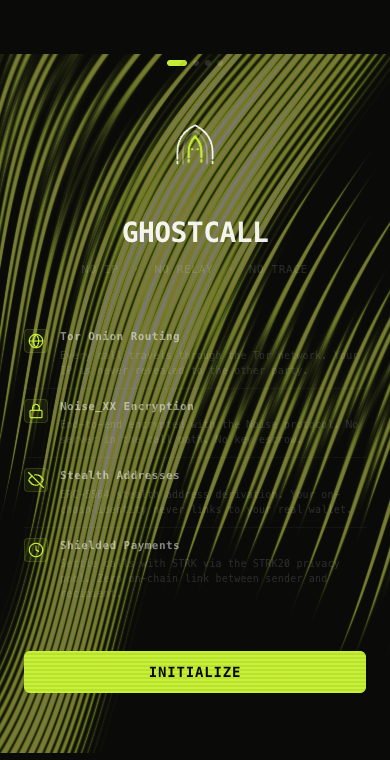

<p align="center">
  
</p>

<p align="center">
  <a href="https://github.com/Philotheephilix/ghostcall/releases/tag/v0.1.0"></a>
  <a href="https://youtu.be/j94K-o8q56Y"></a>
  <a href="https://starkscan.co/contract/0x474eafba0ef66427b796890bffc7d80fa9ec90359f649d85c1c54d50bd359fa"></a>
  <a href="https://philotheephilix.github.io/ghostcall"></a>
</p>

---

Private voice calls and file transfer over Tor — no relay, no metadata, no trace.

## The Problem

Every voice app — Signal, WhatsApp, WebRTC — routes calls through a relay. That relay sees both IP addresses. The operator can be subpoenaed. STUN servers leak your real IP during connection setup before you even pick up.

File transfers are worse. They go through servers. Even apps that claim end-to-end encryption log who sent what to whom and when. The content is encrypted. The graph is not.

## The Solution

- **Tor v3** — both endpoints are onion services, no IP ever exposed to any server
- **Noise_XX** — X25519 key exchange + ChaCha20-Poly1305, call and file transfer encrypted end-to-end
- **ERC-5564 stealth identity** — on-chain handle lookup with one-time keys, caller never links their address to the call
- **STRK20 shielded payments** — post-call payments through privacy pool, severs sender-recipient link on-chain

## Architecture

```
SIGNALLING
  Caller  →  ERC-5564 stealth pubkey lookup (Starknet)
          →  NIP-59 gift-wrapped offer (Nostr relay)
          →  Callee derives one-time key, reads offer

CALL / FILE TRANSFER
  Caller .onion ──[Tor circuit]── Noise_XX ──[Tor circuit]── Callee .onion
         ↑ hidden                encrypted                    hidden ↑

PAYMENT
  Caller  →  shield STRK into STRK20 pool
          →  private transfer inside pool
          →  Callee unshields
          →  CallLog.commit_call(hash) on mainnet
```

## Starknet & STRK20

| | Address |
|---|---|
| **CallLog** | [`0x474eafba0ef66427b796890bffc7d80fa9ec90359f649d85c1c54d50bd359fa`](https://starkscan.co/contract/0x474eafba0ef66427b796890bffc7d80fa9ec90359f649d85c1c54d50bd359fa) |
| **STRK20 pool** | [`0x040337b1af3c663e86e333bab5a4b28da8d4652a15a69beee2b677776ffe812a`](https://starkscan.co/contract/0x040337b1af3c663e86e333bab5a4b28da8d4652a15a69beee2b677776ffe812a) |

**Signalling:** caller looks up callee's ERC-5564 stealth keypair on StealthRegistry, derives a one-time Nostr pubkey, sends a NIP-59 gift-wrapped call offer with the caller's onion address. Callee decrypts, dials back through Tor. No phone number. No account. No server.

**Payment:** after the call, caller shields STRK into the STRK20 privacy pool, does a private transfer to the callee's shielded address, callee unshields. The on-chain record shows pool interactions — not who paid who.

## Screenshots

<p align="center">
  
  &nbsp;&nbsp;
  
  &nbsp;&nbsp;
  
</p>

## Download

[GhostCall v0.1.0 — Mac (Apple Silicon)](https://github.com/Philotheephilix/ghostcall/releases/tag/v0.1.0)

## Demo

https://youtu.be/j94K-o8q56Y
