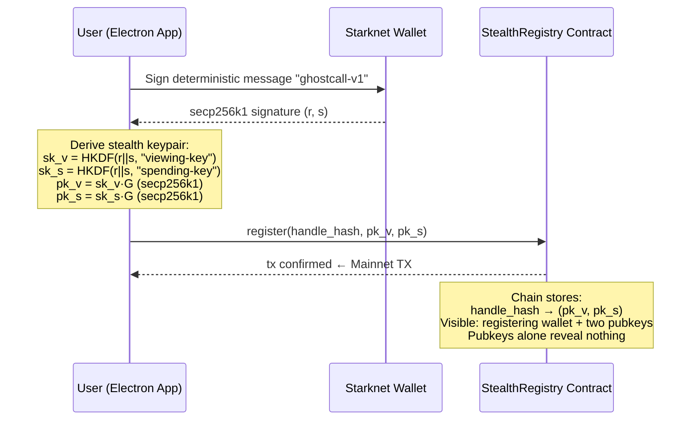
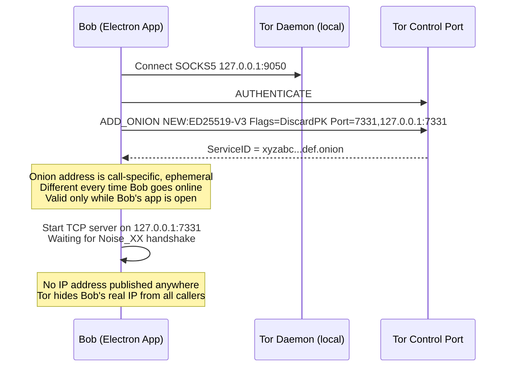
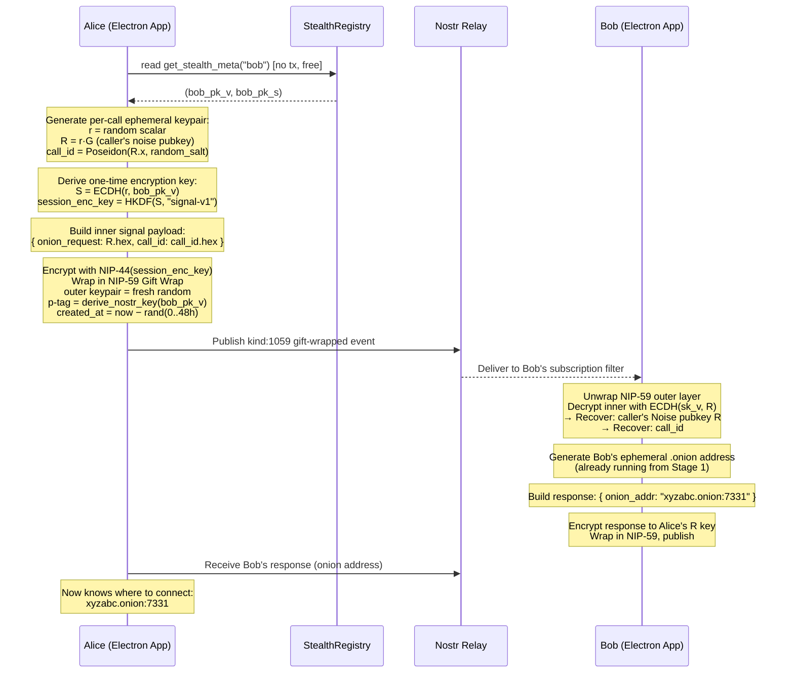
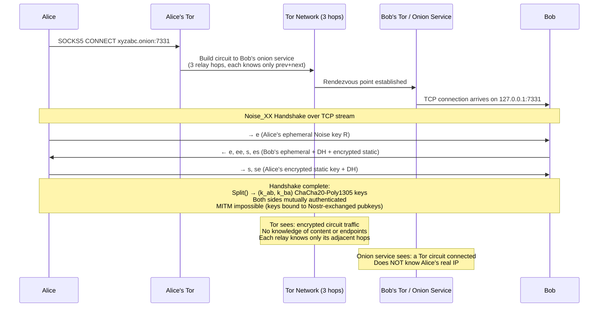
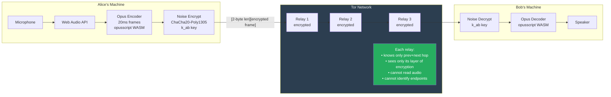
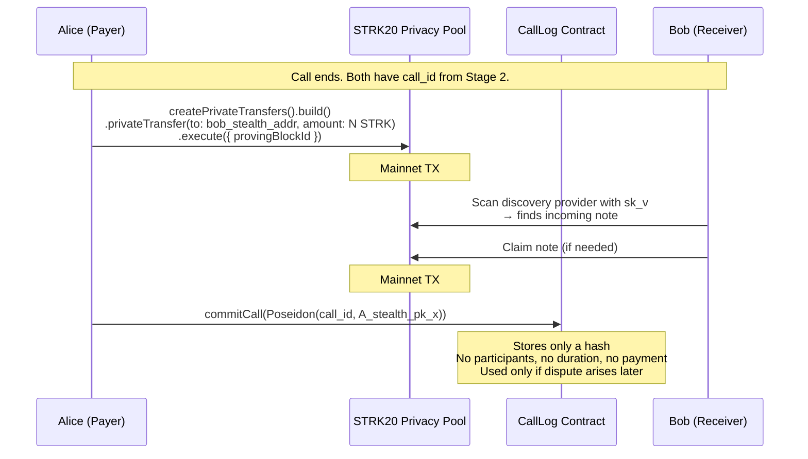
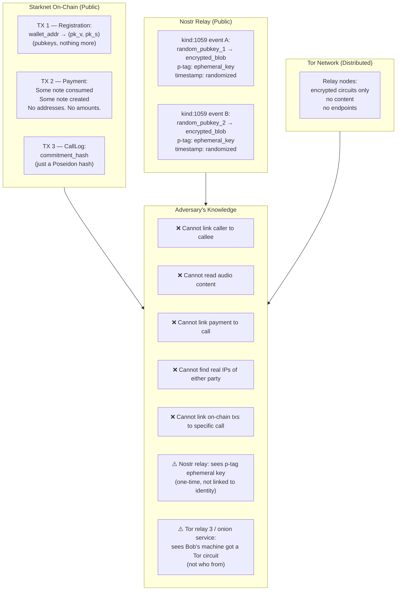

# GhostCall Design Spec

> Trustless, untraceable, unsniffable audio calls on Starknet — STRK20 Private Sprint submission.

---

## Problem

Every existing private calling app (Status.im, Session, Brave Talk) solves media encryption but leaves at least one of: real IP exposure, linkable on-chain identity, or traceable payment graphs. No app on any chain combines ZK identity + shielded payments + Tor-routed audio in one trustless stack.

WebRTC with TURN is the industry default — but TURN requires a trusted relay operator who sees both real IPs. We eliminate the TURN server entirely: audio travels peer-to-peer through Tor onion services. No relay operator. No trusted third party in the media path.

---

## What We're Building

A Next.js app where:
- Users register a **stealth meta-address** on Starknet (one tx, one-time)
- Callers find callees by handle — no real wallet address ever crosses the wire
- **Signaling** (call setup) uses Nostr NIP-17 gift wrap — ephemeral keys, randomized timestamps
- **Media transport** is a raw TCP audio stream through a Tor v3 onion service — no TURN, no relay operator
- **Audio** is Opus-encoded, encrypted with ChaCha20-Poly1305 (Noise_XX over the Tor circuit, defense-in-depth on top of Tor's own encryption)
- **Post-call payment** uses the STRK20 shielded pool — no on-chain link between payer and recipient
- **Call commitment** is stored on-chain as a hash — provable receipt, no participants visible

---

## Why Tor Instead of WebRTC+TURN

| | WebRTC + TURN | WebRTC + self-hosted TURN | **GhostCall (Tor)** |
|--|--|--|--|
| Relay operator knows both IPs | Yes | Yes | **No — Tor circuit hides origin** |
| Relay can do traffic analysis | Yes | Yes | **Partial — onion server sees callee IP only** |
| Trustless (no operator to trust) | No | No | **Yes** |
| Latency | ~50ms | ~50ms | ~150-300ms |
| Browser-native | Yes | Yes | **Requires Tor daemon (Electron or native)** |
| Audio encryption | DTLS-SRTP | DTLS-SRTP | **Noise_XX + Tor layers** |

**The tradeoff is real:** Tor adds latency. Opus at 20ms frames handles up to 500ms of jitter before quality degrades noticeably — Tor circuits typically add 100-250ms, which is acceptable for voice. The gain is genuine trustlessness: the onion service operator (callee's machine) only knows the Tor circuit connected, not who is behind it.

---

## Architecture: 4 Layers

### Layer 1 — Identity (Starknet mainnet)

**Contract: `StealthRegistry`**

Users register once. Stores a stealth meta-address — two secp256k1 public keys:
- `pk_v` (viewing pubkey): callers derive a one-time session key from this
- `pk_s` (spending pubkey): callee recovers inbound session keys from this

```
handle_hash → (pk_v, pk_s)
```

Based on ERC-5564 adapted for Starknet using native `secp256k1_mul_syscall` builtins.

**What the chain sees:** wallet address + two pubkeys. The pubkeys are mathematically unlinkable to any specific call or payment without the private viewing key.

**Contract: `CallLog`**

Stores post-call commitments. One entry per call:
```
commitment_hash = Poseidon(call_id, caller_stealth_pk_x)
```
Just a hash. No participants, no duration, no payment amount. Used for dispute resolution.

---

### Layer 2 — Signaling (Nostr NIP-17, off-chain)

SDP is replaced entirely — there is no WebRTC SDP. Instead the signaling channel exchanges:
1. Callee's **Tor onion address** (generated fresh per call, valid for call duration only)
2. Caller's **Noise_XX ephemeral public key** (for session key establishment)
3. **Call ID** (Poseidon hash used later for on-chain commitment)

Protocol: **Nostr NIP-59 Gift Wrap** (two-layer encryption)
- Inner Seal (kind:13): NIP-44 ChaCha20 encrypted with ECDH(caller_ephemeral_sk, callee_stealth_pk)
- Outer Gift Wrap (kind:1059): encrypted with a freshly generated random keypair per message
- Outer timestamp randomized ±48h — breaks timing correlation
- Relay sees: random pubkey, encrypted blob, p-tag pointing to callee's derived stealth Nostr key

**npm:** `nostr-tools` (NIP-44 encryption, NIP-59 gift wrap, relay pool)

---

### Layer 3 — Media Transport (Tor Onion Service)

This is the core innovation. No TURN server. No WebRTC ICE. Just a TCP socket through Tor.

**How it works:**

1. **Callee** starts a temporary v3 onion service when their app is open (or on incoming call alert). The onion service listens on localhost port 7331. The `.onion` address is the callee's call-specific ephemeral identity — different per call.

2. **Caller** receives the `.onion` address through the Nostr signaling channel (encrypted). Opens a SOCKS5 connection through Tor to `{onion_address}.onion:7331`.

3. A **Noise_XX handshake** runs over this TCP connection:
   - Both sides authenticate with their ephemeral call keypairs
   - Session keys are derived: `(k_send, k_recv)` — ChaCha20-Poly1305
   - This is defense-in-depth on top of Tor's own encryption

4. **Raw Opus audio frames** flow over the Noise-encrypted TCP stream:
   - `getUserMedia()` → Web Audio API → Opus encoder (via `opusscript` WASM) → 20ms frames → Noise encrypt → Tor → decode
   - Frame format: `[2-byte length][encrypted Opus frame]`

**What each party knows:**

| Party | Knows |
|-------|-------|
| Tor network (relay nodes) | Encrypted traffic between Tor nodes — nothing about content or endpoints |
| Callee's onion service | A Tor circuit connected — does NOT know caller's real IP |
| Caller | The callee's one-time `.onion` address — received encrypted via Nostr |
| Nobody | Both real IPs simultaneously |

**Runtime requirement:** Tor daemon must be running on both machines. For the hackathon demo, the app ships with:
- A bundled `tor` binary (cross-platform, via `@tor-browser-bundle/tor`) or
- Instructions to run `tor` and point the app at `127.0.0.1:9050` (SOCKS5)

The app is an **Electron desktop app** (not a pure browser app) — this is the correct architecture for Tor integration. Electron gives access to Node.js APIs needed to spawn `tor` and manage the onion service via the control port.

**Tor control port usage:**
```
AUTHENTICATE
ADD_ONION NEW:ED25519-V3 Flags=DiscardPK Port=7331,127.0.0.1:7331
→ ServiceID=abc123...xyz.onion
DEL_ONION abc123...xyz
```

**npm/libraries:**
- `granax` — Node.js Tor control port client (ADD_ONION, DEL_ONION, circuit management)
- `noise-protocol` — Noise_XX handshake (X25519 + ChaCha20-Poly1305 + SHA-256)
- `opusscript` — Opus encoder/decoder WASM (works in Electron renderer)
- `@noble/curves` — X25519 for Noise keypairs

---

### Layer 4 — Payment (STRK20 Shielded Pool)

Post-call, caller sends a shielded STRK payment to callee using the STRK20 SDK:

```ts
import { createPrivateTransfers } from "@starkware-libs/starknet-privacy-sdk"

const transfers = createPrivateTransfers({
  account,
  viewingKeyProvider: { getViewingKey: async () => viewing_key_bigint },
  provingProvider: { url: PROVER_URL, chainId: "SN_MAIN" },
  discoveryProvider: { url: DISCOVERY_URL },
  poolContractAddress: STRK20_POOL_ADDRESS
})

const { callAndProof } = await transfers
  .build()
  .privateTransfer({ to: callee_stealth_address, amount: payment_amount })
  .execute({ provingBlockId })

await account.execute(callAndProof.call)
```

The pool breaks the sender↔recipient link. Observer sees a note consumed and a note created — no addresses, no amounts readable without the viewing key.

---

## How It Works: Data Flow by Stage

### Stage 0 — One-Time Setup (Registration)



**On-chain footprint:** 1 transaction. Anyone can see the pubkeys but they are unlinkable to any specific call or identity without `sk_v`.

---

### Stage 1 — Callee Goes Online (Ephemeral Onion Setup)



---

### Stage 2 — Call Initiation (Alice Calls Bob)



**What Nostr relay sees:** Two `kind:1059` events. Random outer pubkeys. Encrypted blobs. One p-tag pointing to an ephemeral key derived from Bob's stealth key. Relay cannot identify Alice or Bob, cannot read content, cannot link the two events.

---

### Stage 3 — Connection & Noise Handshake



**Trust model:** Zero trusted parties in the media path. Tor relay nodes are untrusted and see only encrypted traffic. The onion service (Bob's machine) knows a Tor circuit connected but not who is behind it.

---

### Stage 4 — Active Call (Audio Stream)



**Frame format:** `uint16_be(len) || ChaCha20-Poly1305(opus_frame)` — 2 bytes header, then encrypted Opus. At 20ms frames this is ~52 bytes per frame (50 bytes Opus mono 8kHz + 16 byte Poly1305 tag + 2 byte length).

**Latency budget:**
- Opus encode: ~1ms
- Noise encrypt: ~0.1ms
- Tor circuit: ~100-250ms (typical)
- Noise decrypt + Opus decode: ~2ms
- **Total one-way: ~105-255ms** — acceptable for voice

---

### Stage 5 — Post-Call: Payment + On-Chain Commitment



**Three mainnet transactions (hackathon requirement):**
1. `StealthRegistry.register()` — one-time setup
2. `STRK20 pool private transfer` — post-call payment
3. `CallLog.commitCall()` — on-chain call receipt (or Bob claiming note)

---

### Full Observer View: What an Adversary Sees



---

## STRK20 Hackathon Qualification

### The 3 Required Mainnet Transactions

The hackathon requires **3 mainnet transactions** and a **live demo anyone can open**. Here is exactly how we qualify:

| TX | Contract | What it does | When |
|----|----------|-------------|------|
| TX #1 | `StealthRegistry` | Register stealth meta-address | Setup (done once in demo) |
| TX #2 | STRK20 pool | Shielded STRK transfer (post-call payment) | After demo call ends |
| TX #3 | `CallLog` | Commit call receipt hash | After demo call ends |

All three go in `strk20.json` with hashes. The demo video shows: registration → Alice calls Bob via Tor onion → audio works → payment settled privately.

### Judging Criteria — How We Score

**30% STRK20 Integration Depth** — This is our strongest category:
- Stealth meta-address registry (ERC-5564 pattern in Cairo, uses `secp256k1_mul_syscall`)
- STRK20 SDK private transfer (`createPrivateTransfers().build().execute()`)
- CallLog commitment using Poseidon hash (Cairo builtin)
- Viewing key derivation for note discovery
- Full STRK20 pool interaction — not a wrapper, not a demo contract

**30% Working Mainnet Product** — Concrete path:
- Electron app ships with bundled `tor` binary
- User registers on mainnet (TX #1)
- Two machines in demo make a real audio call through Tor
- Payment settles on mainnet (TX #2 + #3)
- Demo URL = GitHub releases page with downloadable binary

**25% Innovation** — The gap we fill:
- No existing app on any chain does: trustless identity (stealth) + Tor audio + shielded payments + on-chain call receipt, all in one stack
- TURN-free architecture is a novel approach — circuit relay or Tor for voice is unexplored in Web3
- The Noise_XX handshake bootstrapped from stealth key material is a new pattern

**15% Docs & Open-Source Quality** — Deliverables:
- `README.md` with architecture diagram, setup instructions, how to run
- `ARCHITECTURE.md` (this spec, simplified)
- Apache-2.0 license
- Inline code comments on non-obvious crypto steps
- `strk20.json` complete with all required fields

### strk20.json Template

```json
{
  "name": "GhostCall",
  "description": "Trustless audio calls on Starknet. Tor transport, stealth addresses, STRK20 shielded payments. No TURN server. No trusted relay.",
  "demo": "https://youtu.be/DEMO_VIDEO_URL",
  "contracts": {
    "StealthRegistry": "0x...",
    "CallLog": "0x..."
  },
  "transactions": [
    "0x... (StealthRegistry.register)",
    "0x... (STRK20 private transfer)",
    "0x... (CallLog.commitCall)"
  ],
  "stack": ["Cairo", "Starknet", "STRK20 SDK", "Tor", "Nostr NIP-17", "Noise Protocol", "Opus", "Electron"],
  "repo": "https://github.com/YOUR_HANDLE/ghostcall"
}
```

### Registration PR (registry.json)

The hackathon entry is one PR to the official registry adding:
```json
{
  "repo": "https://github.com/YOUR_HANDLE/ghostcall",
  "telegram": "@YOUR_HANDLE"
}
```
This PR is the only submission action required. Everything else is read from the public repo.

---

## Threat Model

| Threat | Mitigation | Residual Risk |
|--------|-----------|---------------|
| Real IP exposed to callee | Tor onion service — callee's machine never sees caller IP | None (Tor circuit guarantee) |
| Real IP exposed to relay | Tor — relay nodes see only encrypted circuit segments | Global passive adversary (theoretical) |
| Audio content sniffed | Noise_XX ChaCha20-Poly1305 + Tor layers | None (multiple independent encryption layers) |
| Signaling links caller↔callee | NIP-59 ephemeral keys + randomized timestamps | Nostr relay sees recipient p-tag (ephemeral, not identity) |
| On-chain call data | Only commitment hash stored — no participants, no timing | Commitment hash is public (but meaningless without keys) |
| Payment links to call | STRK20 pool breaks graph | Pool anonymity set size |
| MITM on Noise handshake | Handshake keys exchanged through NIP-44 encrypted channel | Requires compromising NIP-44 to substitute keys |
| Tor circuit timing attack | Randomized Nostr timestamps break call initiation timing | Sophisticated global adversary only |

---

## Tech Stack

| Component | Technology |
|-----------|-----------|
| App shell | Electron 32 (Node.js + Chromium) |
| Frontend | Next.js 14 (App Router) + TypeScript |
| Tor integration | `granax` (control port), bundled `tor` binary |
| Audio capture | Web Audio API (`getUserMedia`) |
| Audio codec | `opusscript` (Opus WASM encoder/decoder) |
| Transport encryption | `noise-protocol` (Noise_XX, X25519, ChaCha20-Poly1305) |
| Signaling | `nostr-tools` (NIP-44 + NIP-59) |
| Identity contract | Cairo 2.x — `StealthRegistry` + `CallLog` |
| Payment SDK | `@starkware-libs/starknet-privacy-sdk` |
| Chain interaction | `starknet.js` v6 |
| Stealth crypto | `@noble/curves` (secp256k1, X25519) |
| Hashing | `@noble/hashes` (HKDF-SHA256) |
| Styling | Tailwind CSS |

---

## Out of Scope (This Sprint)

- Video calls (audio only)
- Group calls (1:1 only)
- Message history / persistent chat
- Mobile app (Electron desktop only)
- Full ZK circuit for call duration proof (Poseidon commitment hash is sufficient)
- Automatic Tor binary download (bundled in release build, manual setup for dev)
