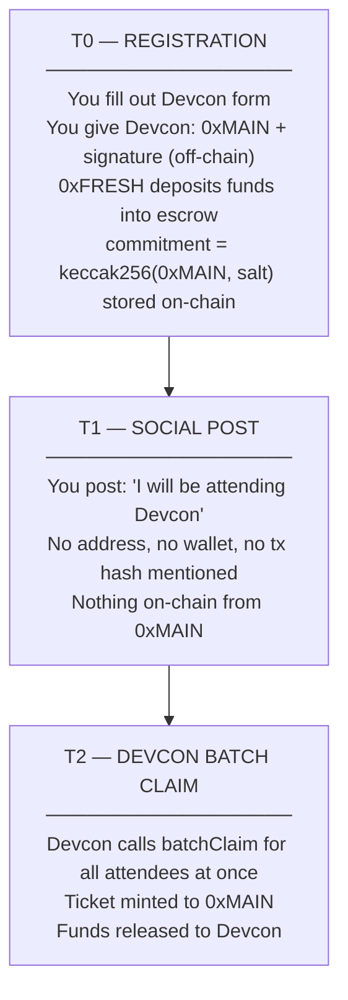
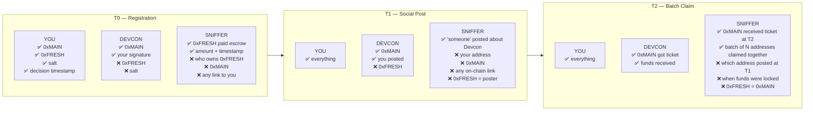
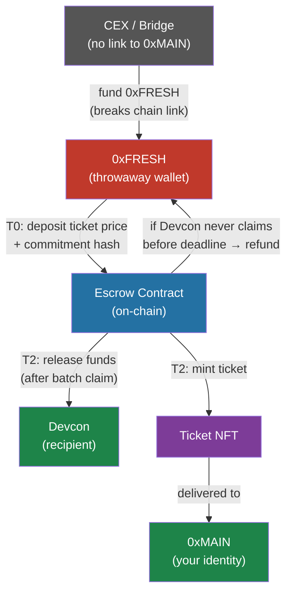
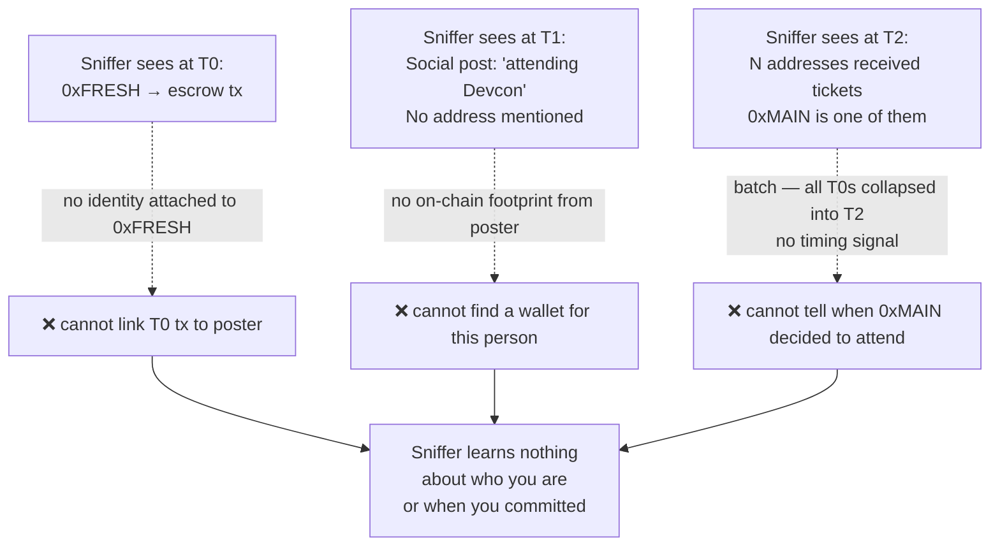

# Private Registration Flow

## What the Sniffer Is Trying to Do

Watch the chain for any wallet activity near your social post timestamp,
then link "this wallet = this person attending Devcon."

---

## Linear Flow

---

## Who Knows What at Each Phase

---

## Fund Flow

### What moves when

| Step | From | To | What | Visible to sniffer |
|---|---|---|---|---|
| Fund 0xFRESH | CEX/bridge | 0xFRESH | Gas + ticket price | 0xFRESH address only — no link to 0xMAIN |
| T0 deposit | 0xFRESH | Escrow | Ticket price + commitment hash | 0xFRESH, amount, commitment blob |
| T2 claim | Escrow | Devcon | Ticket price | 0xMAIN revealed here for first time |
| T2 mint | Escrow | 0xMAIN | Ticket NFT | 0xMAIN, but T0 is cold and batch hides timing |
| Refund (if no claim) | Escrow | 0xFRESH | Ticket price | 0xFRESH only |

---

## What the Sniffer Sees vs Needs

